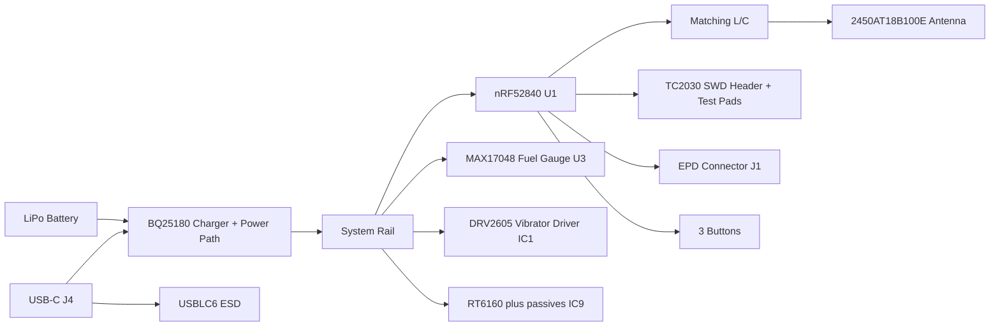

# InkTime - Hardware Design Repository

Proiect hardware pentru un smartwatch open-source, low-cost, realizat în Fusion 360 Electronics (EAGLE format `.sch` + `.brd`).

## Structura repository-ului

- Hardware
	- [Schematic.sch](Hardware/Schematic.sch)
	- [PCB.brd](Hardware/PCB.brd)
- Manufacturing
	- (de adăugat la EVT: `gerbers.zip`, `.bom`, `.cpl`)
- Mechanical
	- (de adăugat la EVT: model complet `.step` și fișier Fusion360)
- Images
	- (de adăugat: randări PCB și ansamblu)

## Diagramă bloc

## BOM (Bill of Materials)

| Ref / Grup | Componentă | Qty | Funcție | JLC / Source link | Datasheet |
|---|---|---:|---|---|---|
| `U1` | nRF52840-QFAA | 1 | MCU BLE + USB | https://jlcpcb.com/parts?searchTxt=nRF52840 | https://infocenter.nordicsemi.com/pdf/nRF52840_PS_v1.1.pdf |
| `IC1` | DRV2605 | 1 | Driver haptic | https://jlcpcb.com/parts?searchTxt=DRV2605 | https://www.ti.com/lit/ds/symlink/drv2605.pdf |
| `IC9` | RT6160A | 1 | Convertor DC/DC pentru rail-uri EPD | https://jlcpcb.com/parts?searchTxt=RT6160 | https://www.richtek.com/assets/product_file/RT6160A/DS6160A-05.pdf |
| `U3` | MAX17048G+T10 | 1 | Fuel gauge Li-Ion | https://jlcpcb.com/parts?searchTxt=MAX17048 | https://www.analog.com/media/en/technical-documentation/data-sheets/MAX17048-MAX17049.pdf |
| `ANT1` | 2450AT18B100E | 1 | Antenă 2.4 GHz | https://jlcpcb.com/parts?searchTxt=2450AT18B100E | https://www.johansontechnology.com/datasheets/2450AT18B100E.pdf |
| `J4` | USB-C 16P (KH-TYPE-C-16P) | 1 | Alimentare + USB | https://jlcpcb.com/parts?searchTxt=TYPE-C-16P | https://datasheet.lcsc.com/lcsc/2006231106_Kinghelm-KH-TYPE-C-16P_C709357.pdf |
| `D1` | USBLC6-2SC6Y | 1 | Protecție ESD USB | https://jlcpcb.com/parts?searchTxt=USBLC6-2SC6Y | https://www.st.com/resource/en/datasheet/usblc6-2.pdf |
| `D3`,`D4`,`D5` | MBR0530 | 3 | Schottky diode | https://jlcpcb.com/parts?searchTxt=MBR0530 | https://www.onsemi.com/pdf/datasheet/mbr0530t1-d.pdf |
| `Q3` | SI1308EDL | 1 | MOSFET control alimentare | https://jlcpcb.com/parts?searchTxt=SI1308EDL | https://www.vishay.com/docs/63399/si1308edl.pdf |
| `DMG2305UX-7` | PMOS | 1 | Comutare rail | https://jlcpcb.com/parts?searchTxt=DMG2305UX | https://www.diodes.com/assets/Datasheets/DMG2305UX.pdf |
| `J1` | 503480-2400 | 1 | Conector display / FPC | https://jlcpcb.com/parts?searchTxt=503480-2400 | https://www.molex.com/pdm_docs/sd/5034802400_sd.pdf |
| `J2` | TC2030-IDC | 1 | Debug/programare SWD | https://www.tag-connect.com/product/tc2030-idc-nl | https://www.tag-connect.com/wp-content/uploads/bsk-pdf-manager/TC2030-IDC-NL.pdf |
| `SW_UP`,`SW_ENT`,`SW_DN` | EVPAKE31A | 3 | Butoane UI | https://jlcpcb.com/parts?searchTxt=EVP-AKE31A | https://industrial.panasonic.com/cdbs/www-data/pdf/ASQ0000/ASQ0000CE153.pdf |
| `X1` | 32 MHz crystal | 1 | Clock HF MCU | https://jlcpcb.com/parts?searchTxt=32MHz%202016 | https://www.nxp.com/docs/en/data-sheet/NX3225SA.pdf |
| `X2` | 32.768 kHz crystal | 1 | RTC clock | https://jlcpcb.com/parts?searchTxt=32.768kHz%203215 | https://www.abracon.com/datasheets/ABS06.pdf |
| `R*` | Rezistențe 0201 | 15 | Bias, pull-up/pull-down, sense | https://jlcpcb.com/parts?searchTxt=0201%20resistor | - |
| `C*`,`EPD_C*` | Condensatoare 0201/0402/0603 | 39 | Decuplare, filtrare, RF matching, EPD charge pump | https://jlcpcb.com/parts?searchTxt=0201%20capacitor | - |
| `L1`,`L2`,`L3`,`L5`,`L7` | Inductoare (RF + power) | 5 | Matching RF + convertoare | https://jlcpcb.com/parts?searchTxt=0402%20inductor | - |
| `TP_*` | Test pads TP20R | 14 | DFT: SWD, alimentări, I2C, reset | https://jlcpcb.com/parts?searchTxt=test%20point | - |

## Funcționalitate hardware detaliată

### Domeniu alimentare

- Intrare alimentare prin USB-C (`J4`) + baterie LiPo.
- Lanț PMIC/charger (`BQ25180`) definit în schemă.
- Fuel gauge (`MAX17048`, `U3`) pentru estimarea stării bateriei.
- Convertor boost/buck (`RT6160`, `IC9`) pentru rail-uri auxiliare folosite de subsistemul display/EPD.
- Diode Schottky (`D3..D5`) și MOSFET-uri (`Q3`, `DMG2305UX-7`) pentru protecție/comutare rail.

### Sub-sistem MCU + RF

- MCU principal: `nRF52840` (`U1`).
- Clock-uri externe:
	- `X1` 32 MHz pentru radio/HF.
	- `X2` 32.768 kHz pentru RTC/low-power.
- Lanț RF de matching cu `L1`, `L3`, `C3`, `C4` către `ANT1`.

### Interfețe externe și debug

- USB-C + protecție ESD (`D1`).
- Header SWD Tag-Connect (`J2`) + test pads (`TP_SWDIO`, `TP_SWDCLK`, `TP_SWO`, `TP_RESET`).
- Test pads de alimentare și I2C (`TP_3V3`, `TP_VBAT`, `TP_GND`, `TP_SDA`, `TP_SCL`, etc.).

### Sub-sistem UI / haptic / display

- 3 butoane (`SW_UP`, `SW_ENT`, `SW_DN`).
- Driver haptic `DRV2605` (`IC1`).
- Conector display (`J1`) + pasive dedicate EPD (`EPD_C*`, `R_PWR_EPD`, etc.).

## Mapare pini nRF52840

| Pin nRF52840 | Net | Rol |
|---|---|---|
| `D+` | `N$58` | USB data plus |
| `D-` | `N$59` | USB data minus |
| `SWDCLK` | `N$63` | Debug clock |
| `SWDIO` | `N$64` | Debug data |
| `ANT` | `N$74` | Ieșire RF către rețeaua de matching + antenă |
| `XC1`, `XC2` | `N$78`, `N$79` | Cristal 32 MHz |
| `P0.00/XL1`, `P0.01/XL2` | `N$112`, `N$114` | Cristal 32.768 kHz |
| `VBUS`, `VDD`, `VDDH`, `DECx`, `VSS` | diverse `N$xx` și `GND` | Alimentare/decuplare conform recomandări Nordic |

### GPIO generale

`P0.02 ... P0.31`, `P1.00 ... P1.15` sunt prezente pe neturi interne `N$44...N$111`.

## Consumul de putere (estimare de ordin de mărime)

Estimare orientativă:

- Sleep profund (MCU + fuel gauge): ordinul zecilor de µA.
- Activ BLE periodic + UI: ordinul câtorva mA mediu.
- Refresh display + haptic: vârfuri semnificativ mai mari, dependente de secvența de comutare a convertorului EPD și durata vibrației.

Energia pentru o baterie de capacitate $C_{bat}$ [mAh] la curent mediu $I_{avg}$ [mA]:

$$
t_{autonomie}[h] \approx \frac{C_{bat}}{I_{avg}}
$$